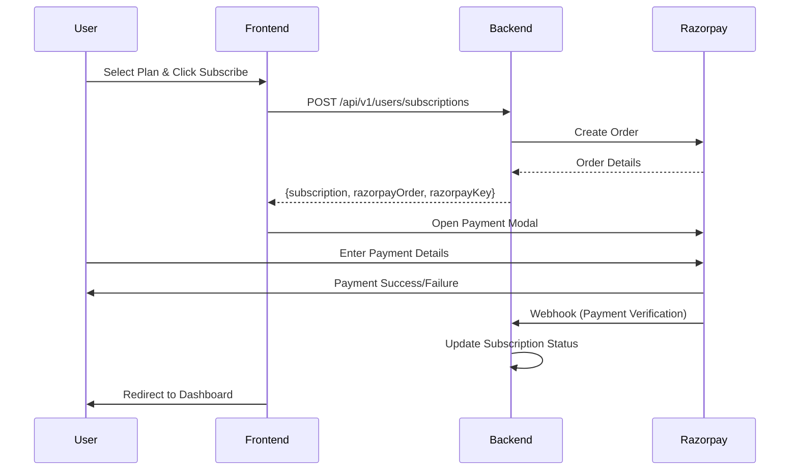

# Subscriptions Feature with Razorpay Integration

A complete subscription management system with Razorpay payment gateway integration for OrangeVC.

## Features

### ✅ Implemented

- **Subscription Management**: Create, view, and track subscriptions
- **Razorpay Integration**: Secure payment processing with Razorpay SDK
- **Active Subscription Detection**: Automatic detection of active subscriptions
- **Payment Flow**: Complete end-to-end payment experience
- **Multi-Plan Support**: Subscribe to different plans from pricing or service pages
- **Subscription Status Tracking**: ACTIVE, PENDING, EXPIRED, CANCELLED statuses
- **Dashboard Integration**: Real-time subscription status in dashboard

## Architecture

```
src/features/subscriptions/
├── types/              # TypeScript type definitions
│   ├── Subscription.ts # Core subscription types
│   ├── api.ts         # API request/response types
│   └── ISubscriptionRepository.ts  # Repository interface
├── lib/               # Business logic
│   ├── ApiSubscriptionRepository.ts  # API integration
│   └── razorpay.ts    # Razorpay SDK utilities
├── hooks/             # React hooks
│   ├── useSubscriptions.ts  # Subscription fetching
│   └── useCreateSubscription.ts  # Subscription creation
└── index.ts           # Feature exports
```

## Subscription Flow



## API Integration

### Endpoints

| Method | Endpoint | Purpose |
|--------|----------|---------|
| POST | `/api/v1/users/subscriptions` | Create subscription & get Razorpay order |
| GET | `/api/v1/users/subscriptions/search` | List all subscriptions |
| GET | `/api/v1/users/subscriptions/active` | Get active subscription |
| GET | `/api/v1/users/subscriptions/:id` | Get subscription by ID |

### Create Subscription Request

```typescript
POST /api/v1/users/subscriptions
{
  "planId": "507f1f77bcf86cd799439011"
}
```

### Create Subscription Response

```typescript
{
  "data": {
    "subscription": {
      "id": "sub_123",
      "userId": "user_456",
      "planId": "plan_789",
      "status": "PENDING",
      "paymentStatus": "PENDING",
      "startDate": "2025-12-14T00:00:00.000Z",
      "endDate": "2026-01-14T00:00:00.000Z",
      ...
    },
    "razorpayOrder": {
      "id": "order_123",
      "amount": 99900,
      "currency": "INR",
      "status": "created",
      ...
    },
    "razorpayKey": "rzp_test_xxxxx"
  },
  "message": "Subscription created successfully"
}
```

## Razorpay Integration

### Setup

1. **Load Razorpay SDK**:
   ```typescript
   import { loadRazorpayScript } from '@/src/features/subscriptions/lib/razorpay';
   
   const isLoaded = await loadRazorpayScript();
   ```

2. **Initiate Payment**:
   ```typescript
   import { initiateRazorpayPayment } from '@/src/features/subscriptions/lib/razorpay';
   
   await initiateRazorpayPayment(
     razorpayKey,
     razorpayOrder,
     {
       name: 'OrangeVC Subscription',
       description: 'Subscription Plan Payment',
       prefill: {
         name: userName,
         email: userEmail,
       },
       onSuccess: (response) => {
         console.log('Payment successful:', response);
       },
       onDismiss: () => {
         console.log('Payment cancelled');
       },
     }
   );
   ```

### Payment Response

```typescript
interface RazorpayPaymentResponse {
  razorpay_payment_id: string;
  razorpay_order_id: string;
  razorpay_signature: string;
}
```

## Usage

### Check Active Subscription

```typescript
import { useActiveSubscription } from '@/src/features/subscriptions/hooks/useSubscriptions';

const { subscription, hasActiveSubscription, isLoading } = useActiveSubscription();

// Use in component
if (hasActiveSubscription) {
  // Show subscribed features
}
```

### Create Subscription

```typescript
import { useCreateSubscription } from '@/src/features/subscriptions/hooks/useCreateSubscription';

const { createSubscription, isCreating } = useCreateSubscription({
  onSuccess: () => {
    console.log('Subscription successful!');
    router.push('/dashboard?subscribed=true');
  },
  onError: (error) => {
    console.error('Subscription failed:', error);
  },
});

// In handler
await createSubscription(
  { planId: 'plan_123' },
  { name: 'John Doe', email: 'john@example.com' }
);
```

## Subscription Entry Points

Users can subscribe from multiple places:

### 1. Pricing Page (`/pricing`)
- View all available plans
- Click "Get Started" on any plan
- Redirects to `/subscribe/[plan-slug]`

### 2. Service Detail Page (`/services/[id]`)
- View service details
- Select a plan from pricing card
- Click "Subscribe Now"
- Redirects to `/subscribe/[plan-slug]`

### 3. Subscribe Page (`/subscribe/[plan-slug]`)
- Review plan details and features
- Confirm account information
- Click "Pay with Razorpay"
- Razorpay modal opens
- Complete payment
- Redirected to dashboard

## Subscription Statuses

### PENDING
- Subscription created
- Payment not yet completed
- Waiting for Razorpay confirmation

### ACTIVE
- Payment successful
- Subscription is live
- User can create tasks

### EXPIRED
- Subscription period ended
- Payment not renewed
- Access revoked

### CANCELLED
- User cancelled subscription
- Access revoked
- No auto-renewal

## Dashboard Integration

The dashboard automatically:
1. Fetches active subscription on load
2. Updates `hasActiveSubscription` state
3. Enables/disables task creation based on status
4. Shows subscription info in profile tab

```typescript
// In Dashboard
const { subscription, hasActiveSubscription } = useActiveSubscription();

<TasksTab hasActiveSubscription={hasActiveSubscription} />
```

## Security

### Payment Security
- Razorpay SDK handles all payment data
- No credit card details stored on frontend
- Payment verification done via backend webhook
- Signature verification prevents tampering

### Authentication
- All subscription APIs require authentication
- Bearer token included in requests
- User can only access their own subscriptions

## Error Handling

### Common Errors

1. **Payment Failed**: User entered wrong details or insufficient funds
2. **Payment Cancelled**: User closed Razorpay modal
3. **Network Error**: API request failed
4. **Plan Not Found**: Invalid plan ID/slug

### Error Recovery

```typescript
const { error } = useCreateSubscription({
  onError: (err) => {
    // Show user-friendly message
    toast({
      title: 'Payment Failed',
      description: err.message,
      variant: 'destructive',
    });
  },
});
```

## Testing

### Test Mode
Razorpay provides test mode with test cards:
- **Success**: `4111 1111 1111 1111`
- **Failure**: `4000 0000 0000 0002`
- CVV: Any 3 digits
- Expiry: Any future date

### Testing Checklist
- ✅ Subscribe from pricing page
- ✅ Subscribe from service detail page
- ✅ Complete payment successfully
- ✅ Cancel payment (close modal)
- ✅ Handle payment failure
- ✅ View active subscription in dashboard
- ✅ Task creation with active subscription
- ✅ Task creation blocked without subscription

## Configuration

### Environment Variables

No additional environment variables needed for Razorpay in frontend. The Razorpay key is returned from the backend API.

### Backend Requirements

Backend must:
1. Create Razorpay order when subscription is created
2. Return Razorpay key in API response
3. Set up Razorpay webhook for payment verification
4. Update subscription status after payment
5. Handle payment failures and cancellations

## Future Enhancements

1. **Subscription Renewal**: Auto-renewal before expiry
2. **Plan Upgrades**: Change plan without cancelling
3. **Billing History**: View past payments
4. **Invoice Generation**: Download invoices
5. **Payment Methods**: Save cards for future use
6. **Proration**: Calculate prorated amounts for upgrades
7. **Cancel Flow**: In-app subscription cancellation
8. **Grace Period**: Allow access for X days after expiry

## Troubleshooting

### Razorpay SDK Not Loading
- Check internet connection
- Verify Razorpay is not blocked by adblocker
- Check browser console for errors

### Payment Not Completing
- Verify backend webhook is configured
- Check Razorpay dashboard for order status
- Ensure signature verification is correct

### Subscription Not Showing Active
- Backend webhook may not have processed yet
- Wait 30 seconds and refresh
- Check backend logs for webhook errors

## Support

For issues or questions:
- Check Razorpay documentation: https://razorpay.com/docs/
- Review backend API logs
- Contact backend team for webhook issues

